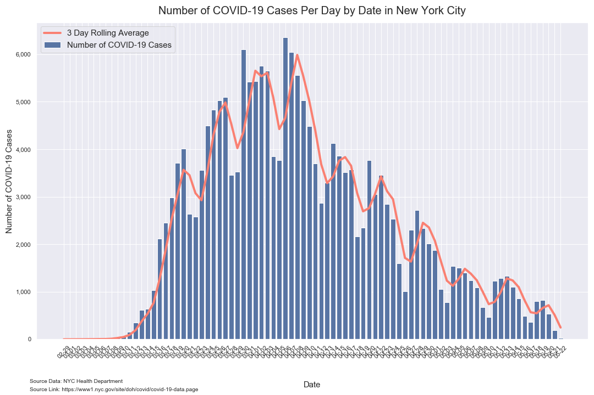

# Analysis of COVID-19 Data for New York City

*Author: Mark Bauer*  
*Date Created: April 16, 2020*  
*Date Updated: April 28, 2020*

Data Provided by: NYC Health Department.  
New York State Statewide COVID-19 Testing Data Repository:  
https://github.com/nychealth/coronavirus-data.  
NYC COVID-19 Data Website: https://www1.nyc.gov/site/doh/covid/covid-19-data.page

Data Description: *This repository contains data on coronavirus (COVID-19) in New York City (NYC), updated daily. Data are assembled by the NYC Department of Health and Mental Hygiene (DOHMH) Incident Command System for COVID-19 Response (Surveillance and Epidemiology Branch in collaboration with Public Information Office Branch). You can view these data on the Department of Health's website. Note that data are being collected in real-time and are preliminary and subject to change as COVID-19 response continues.*

# Figures

## Epidemic Curve

